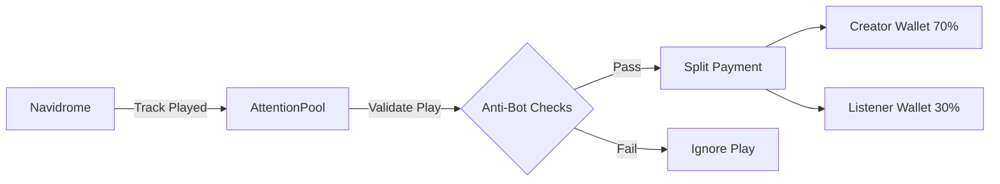

# AttentionPool

**Nanopayment Sidecar for Navidrome**

[](https://opensource.org/licenses/MIT)
[](https://nodejs.org/)
[](https://arc.network)
[](http://makeapullrequest.com)

> **AttentionPool** is a lightweight sidecar service that integrates with [Navidrome](https://www.navidrome.org/) to automatically reward creators and listeners with real-time nanopayments on the Arc blockchain (Testnet).

---

## 📖 Table of Contents

- [Features](#-features)
- [How It Works](#-how-it-works)
- [Prerequisites](#-prerequisites)
- [Installation](#-installation)
- [Configuration](#-configuration)
- [Usage](#-usage)
- [Demo](#-demo)
- [Architecture](#-architecture)
- [Tech Stack](#-tech-stack)
- [Roadmap](#-roadmap)
- [License](#-license)
- [Contributing](#-contributing)
- [Support](#-support)

---

## ✨ Features

- **Automatic Payment Detection** – Listens for tracks played in Navidrome and triggers payments.
- **Split Payments** – Sends **70%** to the Creator, **30%** to the Listener.
- **Lightning-Fast Settlements** – Transactions settle on Arc in under **1 second**.
- **🛡️ Built-in Anti-Bot System**:
  - ✅ Track must be played to **≥90%** completion.
  - 🕒 **30-second cooldown** between plays.
  - 📊 **100 plays/day** limit (resets at UTC midnight).
  - 🎵 **Max 2 rewards** per track per day.
  - 🚫 Seek/fast‑forward detection.
  - 🔐 Gitcoin Passport ready (inactive by default).

---

## ⚙️ How It Works



1. User plays a track in Navidrome.
2. AttentionPool detects the event via Navidrome's Subsonic API.
3. Anti-bot filters validate the play (completion, cooldown, daily limits, etc.).
4. Valid plays trigger a **split payment** on the Arc blockchain.
5. Creator receives **70%**; Listener receives **30%** as a reward.

---

## 🔧 Prerequisites

Before getting started, ensure you have the following:

- [Node.js](https://nodejs.org/) (v20 or higher)
- [Navidrome](https://www.navidrome.org/) running locally (or on a reachable host)
- An Arc blockchain wallet (with some testnet tokens)
- (Optional) [Circle CLI](https://developers.circle.com/) for wallet management

---

## 📦 Installation

Clone the repository and install dependencies:

```bash
git clone https://github.com/jaguard2021/attentionpool.git
cd attentionpool
npm install
```

---

## ⚙️ Configuration

### 1. Create Environment File

Copy the example environment file:

```bash
cp .env.example .env
```

### 2. Fill in Your Credentials

Edit `.env` and add the following variables:

| Variable          | Description                                                  |
|-------------------|--------------------------------------------------------------|
| `PRIVATE_KEY`     | Your Arc wallet private key (testnet)                       |
| `RECEIVER_ADDRESS`| Creator's wallet address (receives 70% royalty)             |
| `NAVI_USER`       | Your Navidrome username                                      |
| `NAVI_PASS`       | Your Navidrome password                                      |

> **Note**: For testing, `RECEIVER_ADDRESS` can be the same as the sender's address if you are both creator and listener.

---

## 🚀 Usage

### Step 1: Start Navidrome

Run Navidrome with your data folder (adjust path as needed):

```bash
navidrome.exe --datafolder "C:\navidrome_data" --port 4534
```

### Step 2: Start AttentionPool

In a separate terminal, start the sidecar:

```bash
node server.js
```

### Step 3: Play Music

Open your Navidrome web interface, play some tracks, and watch real-time payments flow! 💸

---

## 🎥 Demo

[▶️ Click here to watch the demo video](https://your-demo-link.com)

---

## 🏗️ Architecture

```
┌─────────────────┐      Subsonic API       ┌─────────────────┐
│   Navidrome     │◄─────────────────────►│  AttentionPool  │
│  (Music Server) │                        │  (Sidecar)      │
└─────────────────┘                        └────────┬────────┘
                                                     │
                                                     ▼
                                          ┌─────────────────┐
                                          │  Arc Blockchain │
                                          │  (Testnet)      │
                                          └─────────────────┘
```

- **Navidrome** serves music and exposes playback events.
- **AttentionPool** listens via the Subsonic API and validates plays.
- Valid plays trigger **nanopayments** on the Arc blockchain.

---

## 🧰 Tech Stack

- **Node.js** + **Express** – Backend runtime and API server.
- **ethers.js** – Blockchain interaction (Arc).
- **Navidrome Subsonic API** – Event detection.
- **dotenv** – Environment variable management.
- **Circle CLI** – Wallet management (optional).

---

## 🗺️ Roadmap

- [ ] Enable Gitcoin Passport verification.
- [ ] Support multiple creators per track.
- [ ] Build a web dashboard for analytics.
- [ ] Support for mainnet Arc deployment.

---

## 📜 License

This project is licensed under the **MIT License**.  
See the [LICENSE](LICENSE) file for details.

---

## 🤝 Contributing

Contributions are welcome! Please follow these steps:

1. Fork the repository.
2. Create a feature branch (`git checkout -b feature/amazing-feature`).
3. Commit your changes (`git commit -m 'Add some amazing feature'`).
4. Push to the branch (`git push origin feature/amazing-feature`).
5. Open a Pull Request.

---

## 💬 Support

For questions, issues, or suggestions, please [open an issue](https://github.com/jaguard2021/attentionpool/issues).

---

**Built with ❤️ for the music and web3 community.**
