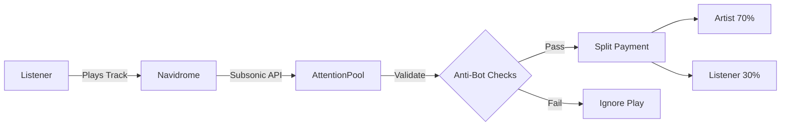
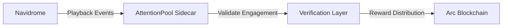

# 🎧 AttentionPool


## Verified Attention Infrastructure

AttentionPool is a micropayment system that verifies real engagement and automatically distributes rewards — starting with music on Navidrome and expanding to all forms of open content.

Built for the **Lepton Agents Hackathon (RFB 06 – Creator & Publisher Monetization)**.

---

# 🎯 The Problem

Today's creator economy has a major problem:

* Artists receive only tiny fractions of platform revenue.
* Platforms monetize attention, not creators.
* Users create value but receive nothing in return.
* Bots can artificially inflate engagement metrics.

As a result, attention is measured, but not rewarded.

---

# 💡 The Solution

AttentionPool turns engagement into a verifiable economic signal.

When a listener genuinely consumes content:

1. Engagement is verified.
2. Anti-bot filters validate authenticity.
3. Micropayments are automatically distributed.
4. Both creators and listeners are rewarded.

Every reward is settled instantly on Arc.

---

# 🚀 Why Arc?

Traditional blockchains struggle with sub-cent transactions because fees often exceed the value transferred.

AttentionPool demonstrates that Arc can enable:

* Near-instant settlement
* Extremely low transaction costs
* Real-time micropayments
* New creator monetization models

During testing:

✅ 20+ real transactions successfully settled on Arc Testnet

✅ Verified listening events triggered on-chain rewards

✅ Creator and listener payments distributed automatically

This proves that sub-cent payments are economically viable.

---

# ✨ Features

| Feature                   | Description                                                |
| ------------------------- | ---------------------------------------------------------- |
| 🎵 Verified Listening     | Only completed listens (≥90%) qualify for rewards          |
| 💰 Split Payment          | 70% royalty to creators, 30% incentive to listeners        |
| 🌐 Open Registry          | Artists and listeners self-register wallets                |
| 👥 Multi-User Support     | Independent state, cooldowns, and rewards per user         |
| ⚡ Real-Time Settlement    | Instant payments on Arc                                    |
| 🛡️ Anti-Bot System       | Completion checks, cooldowns, seek detection, daily limits |
| 🔐 Gitcoin Passport Ready | Optional Sybil resistance layer                            |

---

# ⚙️ How It Works



## Step-by-Step

1. User plays a track in Navidrome.
2. AttentionPool detects the playback event via the Subsonic API.
3. Anti-bot filters validate the listening activity.
4. Verified engagement triggers a reward.
5. Arc settles payments automatically.
6. Creator receives 70%.
7. Listener receives 30%.

---

# 🛡️ Anti-Bot Protection

AttentionPool includes multiple protection layers:

✅ Track must reach at least 90% completion

✅ Minimum listening duration

✅ 30-second cooldown between rewards

✅ Maximum 100 rewards per day

✅ Maximum 2 rewards per track per day

✅ Seek / fast-forward detection

✅ Gitcoin Passport integration ready

Only verified attention generates rewards.

---

# 📊 Hackathon Results

Successfully demonstrated:

* 20+ successful Arc Testnet transactions
* Real-time creator royalties
* Real-time listener incentives
* Anti-bot verified engagement
* Fully automated payment flow
* Multi-user reward distribution

---

# 🏗️ Architecture



### Components

#### Navidrome

Provides music streaming and playback information.

#### AttentionPool

Monitors listening activity and coordinates rewards.

#### Verification Layer

Applies anti-bot and engagement validation rules.

#### Arc Blockchain

Handles settlement and reward distribution.

---

# 🔧 Prerequisites

| Requirement | Details                                |
| ----------- | -------------------------------------- |
| Node.js     | v20 or higher                          |
| Navidrome   | Running locally or on a reachable host |
| Arc Wallet  | Testnet wallet with tokens             |
| Circle CLI  | Optional                               |

---

# 📦 Installation

Clone the repository:

```bash
git clone https://github.com/jaguard2021/attentionpool.git

cd attentionpool

npm install
```

---

# ⚙️ Configuration

## 1. Create Environment File

```bash
cp .env.example .env
```

## 2. Configure Environment Variables

| Variable         | Description                    |
| ---------------- | ------------------------------ |
| PRIVATE_KEY      | Arc testnet wallet private key |
| RECEIVER_ADDRESS | Default creator wallet         |
| LISTENER_ADDRESS | Default listener wallet        |
| NAVI_USER        | Navidrome username             |
| NAVI_PASS        | Navidrome password             |

Example:

```env
PRIVATE_KEY=your_private_key
RECEIVER_ADDRESS=0x123...
LISTENER_ADDRESS=0x456...
NAVI_USER=admin
NAVI_PASS=password
```

---

## 3. Optional Registry Files

### artists.json

```json
[
  {
    "artist": "Example Artist",
    "wallet": "0x123..."
  }
]
```

### listeners.json

```json
[
  {
    "username": "listener1",
    "wallet": "0x456..."
  }
]
```

---

# 🚀 Usage

## Step 1 — Start Navidrome

```bash
navidrome.exe --datafolder "C:\navidrome_data" --port 4534
```

---

## Step 2 — Start Registry Server

```bash
node registry-server.js
```

Website:

```text
http://localhost:3001
```

---

## Step 3 — Start AttentionPool

```bash
node server.js
```

---

## Step 4 — Play Music

Open Navidrome and start listening.

Verified plays automatically trigger Arc micropayments.

---

# 📁 Project Structure

```text
attentionpool/
├── server.js
├── botFilters.js
├── registry-server.js
├── artists.json
├── listeners.json
├── plays.json
├── plays_full.json
├── public/
│   └── index.html
├── .env.example
├── package.json
└── README.md
```

---

# 🧰 Tech Stack

| Technology       | Purpose                    |
| ---------------- | -------------------------- |
| Node.js          | Backend runtime            |
| Express          | API server                 |
| ethers.js        | Arc blockchain interaction |
| Navidrome API    | Playback monitoring        |
| dotenv           | Configuration management   |
| Gitcoin Passport | Sybil resistance           |
| Arc Testnet      | Settlement layer           |

---

# 🌍 Future Vision

AttentionPool is not just a music royalty engine.

Music is the first implementation of a broader concept:

## Verified Attention Infrastructure

Future integrations:

* 🎙️ Podcasts
* 📖 Audiobooks
* 📺 Video Platforms
* 📡 Livestreams
* 🐘 Mastodon Creators
* 📰 Open Publishing Networks
* 🎵 MusicBrainz Payee Registry

Any content with measurable engagement can become monetizable.

---

# 🗺️ Roadmap

* [ ] Enable Gitcoin Passport verification
* [ ] Multiple creators per track
* [ ] Analytics dashboard
* [ ] Mainnet Arc deployment
* [ ] MusicBrainz integration
* [ ] Mastodon creator rewards
* [ ] Podcast monetization
* [ ] Audiobook rewards

---

# Demo

## 🎥 Demo


- **Demo Video:** [Click here to watch](https://www.youtube.com/watch?v=qdkgg1VlmiI)

- **Live Website:** [Click here to visit](https://jaguard2021.github.io/attentionpool/)

GitHub Repository:
https://github.com/jaguard2021/attentionpool

---

# 🤝 Contributing

Contributions are welcome.

1. Fork the repository
2. Create a feature branch

```bash
git checkout -b feature/amazing-feature
```

3. Commit your changes

```bash
git commit -m "Add amazing feature"
```

4. Push to your branch

```bash
git push origin feature/amazing-feature
```

5. Open a Pull Request

---

## 🧠 Known Limitations

This is a hackathon prototype. The following are intentional trade-offs:

- **File-based storage** — `artists.json`, `listeners.json`, `plays_full.json` are read/written synchronously. For production, a database is recommended.
- **No authentication** — Anyone can register an artist or listener. In production, wallet signature verification (e.g., `personal_sign`) should be added.
- **History grows indefinitely** — `plays_full.json` accumulates all transactions. For long-term use, partition by month or use a database.
- **Race conditions** — Concurrent writes to JSON files can cause data loss. For demo purposes, this is acceptable.

# 📜 License

This project is licensed under the MIT License.

See the LICENSE file for details.

---

# 💬 Support

For questions, issues, or suggestions, please open a GitHub Issue.

---

Built with ❤️ for creators, listeners, and the future of verified attention.
